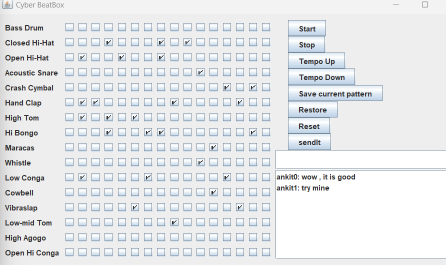
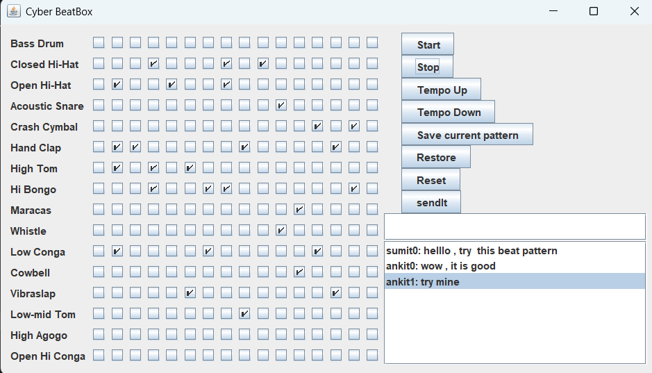
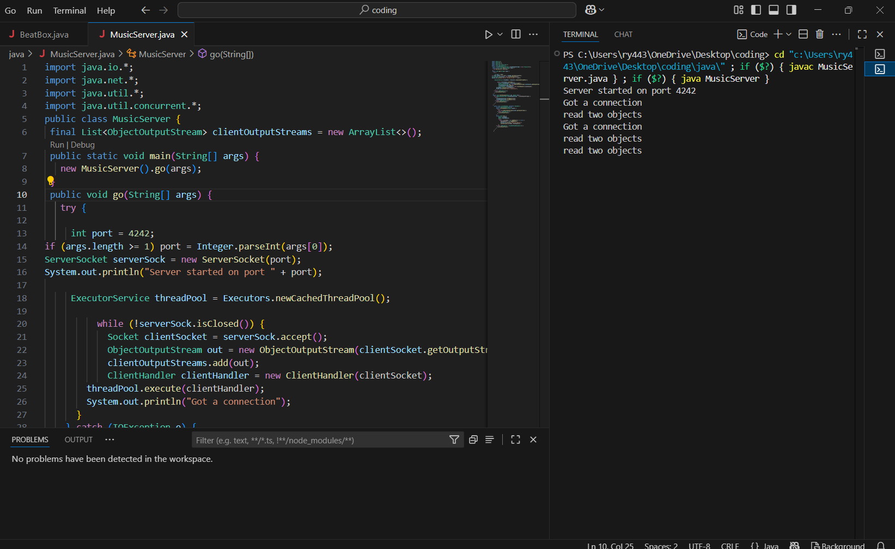
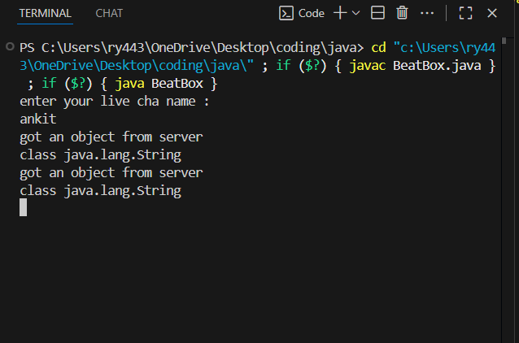

# 🎵 Cyber BeatBox (Java Swing + MIDI + java networking )

A **collaborative beatbox application** built in Java.
Cyber BeatBox lets users create 16×16 drum patterns, control playback with MIDI, save/restore patterns, and even share them live with other users over a server.

Originally inspired by “Head First Java”, extended with networking, file handling, and a Swing GUI.

---

## 🚀 Features

* 🎛 **16 instruments × 16 steps** (drum grid sequencer)
* ▶️ Start / ⏹ Stop playback
* ⏫ / ⏬ Adjust tempo (speed up or slow down)
* 💾 Save & Restore patterns from files
* 🔄 Reset grid in one click
* 🌍 **Networking support**

  * Run a central `MusicServer`
  * Multiple clients (`BeatBox`) can join, chat, and share their drum patterns in real time

---

## 🛠️ Technologies Used

* **Java SE 17+**
* **Swing** (GUI)
* **Java Sound API (MIDI)**
* **Java Networking (Sockets, I/O Streams)**
* **Concurrency** with `ExecutorService`
* **Serialization** for saving patterns

---

## 📂 Project Structure

```
beatbox/
├─ src/
│  ├─ BeatBox.java      # Client (UI + MIDI player)
│  └─ MusicServer.java  # Server (handles clients & shares patterns)
├─ README.md
├─ .gitignore
└─ LICENSE   (optional)
```

---
# BeatBox & MusicServer Project

This project consists of two Java programs:

- **MusicServer.java**: The server that relays beatbox messages between clients.
- **BeatBox.java**: The client application that lets users create and share beat patterns in real time.


## 🚀 Quick Start with Scripts

Instead of typing commands, just use the provided scripts.

### On Linux / Mac / WSL


# simple  example 
```bash
chmod +x runClient.sh   # first time only
./runServer.sh       # start server on port 4242
./runClient.sh       # start client (localhost:4242)
```

(*for running server*):-
```bash
chmod +x runServer.sh   # first time only
./runServer.sh          # runs on port 4242(by defualt if not specified )
./runServer.sh 5000     # runs on port 5000

#This compiles and launches MusicServer.java on port 4242. You can change the port inside the script if needed.
```

(*for running clients*):-
```bash
chmod +x runClient.sh   # first time only
./runClient.sh          # connects to localhost:4242
./runClient.sh 192.168.1.50 5000   # connects to remote server
#host: IP or domain of the server (e.g., localhost, 192.168.1.5, or 0.tcp.ngrok.io)
#port: Port number (default: 4242)
```

### ON Windows

# simple  example 
runServer.bat
runClient.bat


(*for running server*):-
Double-click, or run in terminal:
runServer.bat
runServer.bat 5000


(*for running clients*):-
Double-click, or run in terminal:
runClient.bat
runClient.bat 192.168.1.50 5000


#### 🚀 How to Run

### 1. **Clone the Repository**

```bash
git clone https://github.com/<your-username>/beatbox.git
cd beatbox/src
```

### 2. **Compile the Java Files**

```sh
javac MusicServer.java
javac BeatBox.java
```

---

### 3. **Run the Server**

#### **Default Port (4242):**
```sh
java MusicServer
```

#### **Custom Port:**
```sh
java MusicServer 5555
```
*(Replace `5555` with any port number you want)*

---

### 4. **Run the Client(s)**

#### **On the Same Machine as the Server:**
```sh
java BeatBox
```
- When prompted for your name, enter any username.
- The client will connect to `localhost` on port `4242` by default.

#### **Connect to a Server on a Different Machine:**
```sh
java BeatBox <server-ip> <port>
```
- Example:
  ```sh
  java BeatBox 192.168.1.10 5555
  ```
  - `192.168.1.10` is the server's IP address.
  - `5555` is the port the server is running on.

#### **Multiple Clients:**
- You can run several clients (on the same or different computers) to join the same session.

---

## 💡 Scenarios

### **A. Localhost (Single Computer)**
1. Open a terminal and start the server:
   ```
   java MusicServer
   ```
2. Open another terminal and start the client:
   ```
   java BeatBox
   ```

### **B. LAN (Multiple Computers)**
1. Start the server on one computer:
   ```
   java MusicServer 5555
   ```
2. Find the server computer's IP address (e.g., `192.168.1.10`).
3. On other computers, run:
   ```
   java BeatBox 192.168.1.10 5555
   ```

### **C. Custom Port**
- Always specify the same port for both server and clients.

---

## 📝 Notes

- **Firewall:** Make sure the server's port is open on your firewall.
- **Java Version:** Use Java 8 or higher.
- **Network:** All clients must be able to reach the server's IP and port.

---

## 🛠️ Troubleshooting

- **"Connection refused" or "Timed out":**
  - Check server is running and listening on the correct port.
  - Check firewall settings.
  - Ensure you are using the correct IP address.

- **"File not found" when compiling:**
  - Make sure you are in the correct directory (`cd coding/java`).


## 🌍 Networking Scenarios

* **Local test (single PC)**: Run server + 2+ clients on the same computer → use `localhost`.
* **LAN (same Wi-Fi)**: Run server on one machine, clients connect using the server machine’s local IP (e.g. `192.168.x.x`).
* **Over the Internet**:

  * Use **Ngrok** or a **VPS** to expose your server publicly.
  * Example with ngrok:

    ```bash
    ngrok tcp 4242
    ```

    → Share the public host/port with friends, they connect via:

    ```bash
    java BeatBox 0.tcp.ngrok.io 12345
    ```

---

## 📸 Screenshots 

  
 
*UI with 16×16 drum grid*



*Server console showing connections*


## 📄 License

MIT License © 2025 [Sumit Yadav]

This project is licensed under the [MIT License](./LICENSE).
---


